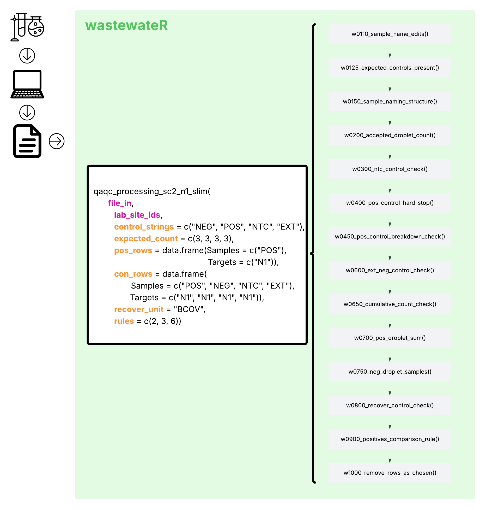

```{r, include = FALSE}
knitr::opts_chunk$set(
  collapse = TRUE,
  comment = "#>"
)
```

```{r setup}
library(tidyverse)
library(wastewateR)
```


This vignette dives into an example of how the wrappers and minor functions of this package interact.

The wrapper functions are all intended as processing functions for a specific pathogen or set of pathogens. The idea is that the majority of the standard inputs and rules are set, and the user just needs to provide a small amount of information that is specific to their use-case (i.e. their data file, and their sample site identifiers). Most wrappers include additional flexibility, including the ability to change control naming conventions. If a user wanted additional flexibility beyond that, then they would need to string together the minor functions for their own use.

### What Happens Before Using `wastewateR`

* Laboratory methods (RNA/DNA extraction, ddPCR)

* Thresholding

* Final results data file export (likely from Quantasoft BioRad Software)

Figure 1. An Explanation of the SARS-CoV-2 N1 'Slim' Wrapper Function
{fig-align="center"}

### Using `wastewateR` for Processing / QAQC 

For processing / post-laboratory methods and pre-analysis quality assurance & quality control (QAQC), the `wastewateR` package is meant to handle a .csv file export of laboratory data results. The main source of that file is expected to be the Quantasoft BioRad Software, however, the columns are fairly consistent with other measurement expectations, so other sources should be able to be processed. 

There are stand-alone functions that are part of `wastewateR`, however, those are described elsewhere. For this vignette, we are focusing on the interaction between the minor functions and the wrapper functions, within the context of processing and QAQC. The goal of `wastewateR` was to be modular and flexible, while still handling the standardization and automation ideals for higher quality data processing within the context of wastewater epidemiology. There are other use cases for this package, but this was the impetus for its creation. There was an understanding that different laboratories and different testing methods would require different standards and inputs. The package was therefore, built modularly (i.e. the minor functions exist) but with an eye for ease of use, these minor functions were put into a set of "standard" functions, which here we call wrappers. These attempt to provide a scaffolding to cover the most likely situation for different pathogens. Please also note, that the initial creation of this package was for a specific wastewater epidemiology program at the state of Michigan's Department of Health and Human Services, so there are some features that reflect their standards and would perhaps need alteration for others to use. 


In Figure 1, the fourteen minor functions that are used within the wrapper function are displayed in grey, in the order that they are used. The wrapper function name and the inputs that it allows are in the white square to the left of those listed functions. In that white square, the inputs that are *REQUIRED* by the function are written in <b style='color:#D32289;'>bold hot pink</b>. All other inputs are written in <b style='color:#F6A951;'>bold orange</b> and are not required for use. If they are not provided, the default inputs are used. However, their presence allows for some additional flexibility within the use of the wrapper function, hopefully decreasing some need for stringing the minor functions together oneself. 

The wrapper function:

```{r}
#| eval: false
#| echo: true

qaqc_processing_sc2_n1_slim <- function(file_in,
                                        lab_site_ids,
                                        control_strings = c("NEG", "POS", "NTC", "EXT"),
                                        expected_count = c(3, 3, 3, 3),
                                        pos_rows = data.frame(Samples = c("POS"),
                                                              Targets = c("N1")),
                                        con_rows = data.frame(Samples = c("POS", "NEG", "NTC", "EXT"),
                                                              Targets = c("N1", "N1", "N1", "N1")),
                                        recover_unit = "BCOV",

                                        rules = c(2, 3, 6)){

  file_in <- w0110_sample_name_edits(file_in)

  file_in <- w0125_expected_controls_present(file_in,
                                             control_strings,
                                             expected_count)

  error_line <- c("w0125")
  error_val <- c(file_in[2][[1]])

  file_in <- w0150_sample_naming_structure(file_in[1][[1]],
                                           lab_site_ids,
                                           control_strings)

  error_line <- c(error_line, "w0150")
  error_val <- c(error_val, file_in[2][[1]])

  file_in <- w0200_accepted_droplet_count(file_in[1][[1]])

  file_in <- w0300_ntc_control_check(file_in)
  error_line <- c(error_line, "w0300")
  error_val <- c(error_val, file_in[2][[1]])

  error_line <- c(error_line, "w0400")
  error_val <- c(error_val, w0400_pos_control_hard_stop(file_in[1][[1]], pos_rows))


  file_in <- w0450_pos_control_breakdown_check(file_in[1][[1]], pos_rows, 35)


  file_in <- w0600_ext_neg_control_check(file_in, 3, 3, 3, 1)

  error_line <- c(error_line, "w0600")
  error_val <- c(error_val, file_in[2][[1]])

  error_line <- c(error_line, "w0650")
  error_val <- c(error_val, w0650_cumulative_count_check(file_in[1][[1]], 3, "no"))

  file_in <- w0700_pos_droplet_sum(file_in[1][[1]], controls_to_drop = con_rows)

  file_in <- w0750_neg_droplet_samples(file_in, controls_to_drop = con_rows)
  error_line <- c(error_line, "w0750")
  error_val <- c(error_val, file_in[2][[1]])

  file_in <- w0800_recover_control_check(file_in[1][[1]], recover_unit, control_strings, 0.3)

  file_in <- w0900_positives_comparison_rule(file_in, pos_rows[, 1], pos_rows[, 2], control_strings, 3)

  file_in <- w1000_remove_rows_as_chosen(file_in, rules)

  error_df <- data.frame(error_line, error_val)

  message("End wrapper for SARS-CoV-2 N1 (slim).")

  return(list(file_in, error_df))

}

```


